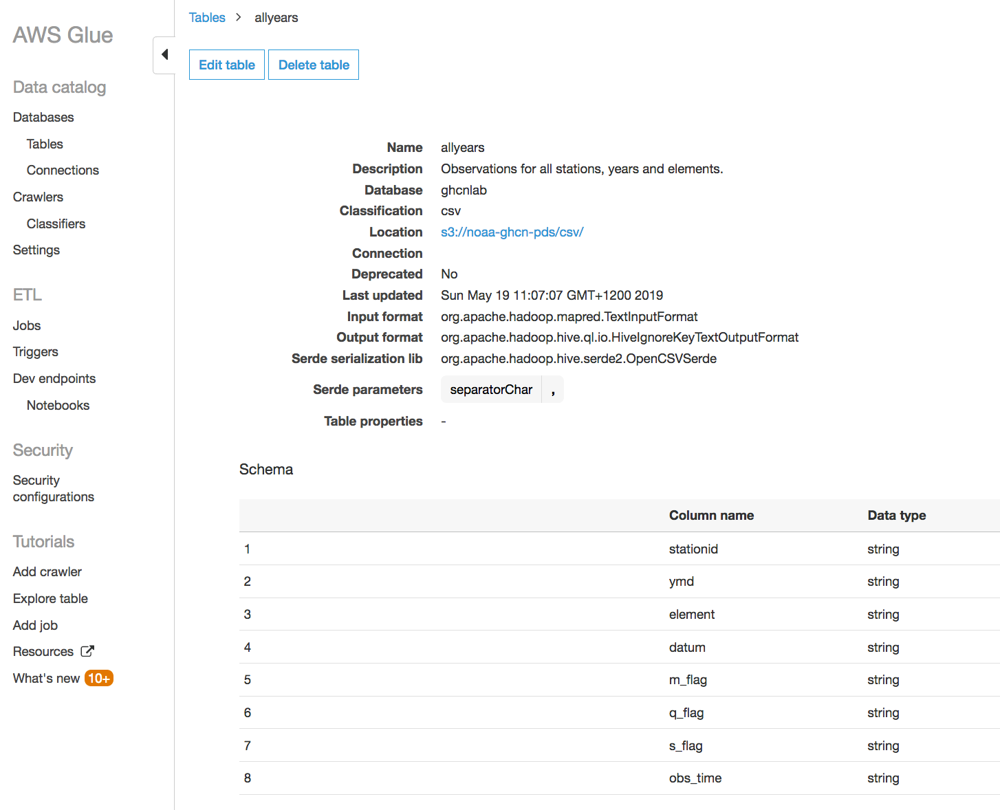

# NZ Tech Week 2019 - Analytics on AWS

## Preparation

### Choose an S3 Bucket Prefix
During this lab, you will create a number of S3 buckets. Because S3 bucket names need to be globally unique, you should now choose a bucket name prefix based upon your name or email address. For example, `craigr-amazon`. Make a note of your choice. These instructions will subsequently refer to this prefix as `{MyS3Prefix}`. For example, suppose you chose `saraq-edu-nz` as your prefix, and the instructions say to create an S3 bucket called `{S3Prefix}-stations`. Then you should create a bucket called `saraq-edu-nz-stations`.

## Browse the Global Historical Climate Network, Daily Time Series

- Login in AWS Console

- Switch region in toolbar to *N. Virginia* (us-east-1). We'll discuss why we've chosen this region later in the lab.

- Click *Services* in toolbar, then Select *Glue*. If you see the Glue welcome page, click *Get started*.

- Click *Databases* in the sidebar (under *Data catalog*)

- Click *Add database* button.

- Type `ghcnlab` as the *Database name*. Leave the *Location* empty, and enter your choice of *Description*. Then click the *Create* button. You should now see the `ghcnlab` database listed.

- Click *Tables* in the sidebar (under *Data catalog* / *Tables*).

- Click the *Add tables* drop-down menu, and select *Add table manually*. A table creation wizard will appear.

- Type `allyears` as the *Table name*. Select `ghcnlab` as the *Database*. Enter something like `Observations for all stations, years and elements` in the *Description*. Click *Next*.

**Important:** This is where we reference the NOAA GHCN observations published in the AWS Registry of Open Data

- On the *Add a data store* page, locate the *Data is located in* radio buttons, and select *Specified path in another account*. Then under *Include path*, enter this URL: `s3://noaa-ghcn-pds/csv/`. Then click *Next*.

> We are telling the AWS Glue service that source data for the table is in an S3 bucket owned by NOAA, but with the standard access policy modified so that it's shared with the world.

- On the *Choose a data format* page, locate the *Classification* radio buttons, and select the *CSV* option. You will be prompted for a *Delimter*. Select *Comma* from the drop-down. Then click *Next*.

> We are telling AWS Glue what format NOAA is using. Glue can automatically discover this for itself using a Crawler, but we're do this manually in the lab.

- On the *Define a schema* page, click the *Add column* button. An *Add column* dialogue will pop up. Type `stationid` in the *Column name* field. The *Column type* is *string*. Leave *Partition key* unchecked. Let the *Column number* default. Click the *Add* button. You will see the new column listed on the schema page.

- Click the *Add column* button again. We're going to add several more columns. All have a *Column type* of *string*. Here is the full list of the column names:
  - stationid
  - ymd
  - element
  - datum
  - m_flag
  - q_flag
  - s_flag
  - obs_time

- You will see the list of 8 columns on the schema page. Click *Next*.

- The final step in the wizard is the *Review* page. Review the settings, then click the *Finish* button. You will now return to the list of tables in the Glue Data Catalog. If you click on the `allyears` table name, you'll see: 

- We can now browse the Global Historical Climate Network, Daily Time Series using the AWS Athena service. Click *Services* in the AWS Console toolbar, then Select *Athena*. Make sure the region in the toolbar is set to *N. Virginia*. If you see the Athena welcome page, click *Get started*.

> AWS Athena is able to run SQL queries directly against S3 buckets. There is no need to load the data into a relational database first. However, Athena does need to run in the same region as the S3 buckets that it's querying. That's why we set the region to N.Virginia at the start of the lab - NOAA's `s3://noaa-ghcn-pds` bucket is located in N.Virginia.

- Select *Query Editor* from the Athena menu. In the sidebar, under *Database*, select `ghcnlab` from the drop down. In the sidebar, under *Tables*, you should see the `allyears` table that we just defined in AWS Glue. Athena is integrated with the Glue data catalog. If you expand the table definition, you'll see the columns we just defined.

- Next to `allyears` table, you'll see a context menu button (three vertical dots). Click the button, and the context menu will contain a *Preview table* option. Click *Preview table*, and an auto-generated SQL statement will be inserted into a *New query* SQL editor tab in the main part of the Athena console page. Here's what the SQL should look like:

```SQL
SELECT * FROM "ghcnlab"."allyears" limit 10;
```

- Click the *Run query* button under the SQL editor tabs. A few seconds later, 10 weather observations will appear. Athena has obtained these from the live NOAA dataset.

> Historical note: the query results will probably include temperatures from a station id EZE00100082, with a ymd of 17930101. These temperatures were measured in Prague in Jan 1793, and are among the first systematic, quality controlled weather observations ever made!
