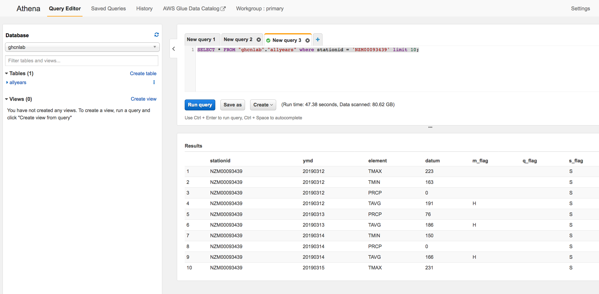
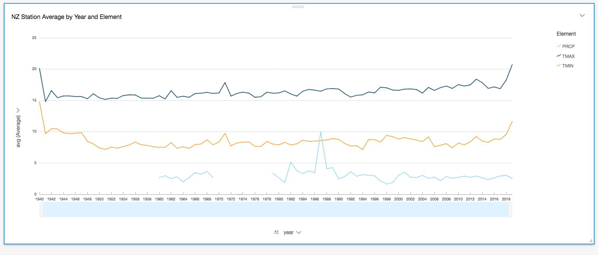
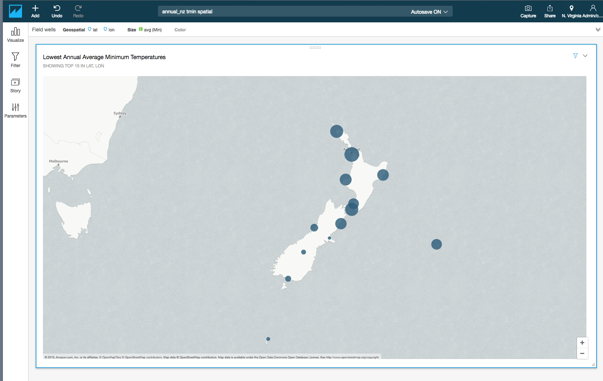

# NZ Tech Week 2019 - Analytics on AWS

## Preparation

### Choose an S3 Bucket Prefix
During this lab, you will create a number of S3 buckets. Because S3 bucket names need to be globally unique, you should now choose a bucket name prefix based upon your name or email address. For example, `craigr-amazon`. Make a note of your choice. These instructions will subsequently refer to this prefix as `{MyS3Prefix}`. For example, suppose you chose `saraq-edu-nz` as your prefix, and the instructions say to create an S3 bucket called `{S3Prefix}-stations`. Then you should create a bucket called `saraq-edu-nz-stations`.

## Background
We're going to be working with a data set called the Global Historical Climate Network, Daily Time Series. (GHCN-D) This data set is collected from sources such as national meteorological agencies (e.g. NZ MetService, NIWA, the Australian Bureau of Meteorology, the UK Met Office etc.) and published by the US National Oceanic and Atmospheric Administration (NOAA). AWS provides an efficient channel for publishing this data through its Open Data Programme. You can read about this, and many other public data sets, on the [AWS Open Data Registry](https://registry.opendata.aws). The GHCN-D registry entry is <https://registry.opendata.aws/noaa-ghcn/>.


## Module 1: Browse the Global Historical Climate Network, Daily Time Series

- Login in AWS Console

- Switch region in toolbar to *N. Virginia* (us-east-1). We'll discuss why we've chosen this region later in the lab.

- Click *Services* in toolbar, then Select *Glue*. If you see the Glue welcome page, click *Get started*.

- Click *Databases* in the sidebar (under *Data catalog*)

- Click *Add database* button.

- Type `ghcnlab` as the *Database name*. Leave the *Location* empty, and enter your choice of *Description*. Then click the *Create* button. You should now see the `ghcnlab` database listed.

- Click *Tables* in the sidebar (under *Data catalog* / *Tables*).

- Click the *Add tables* drop-down menu, and select *Add table manually*. A table creation wizard will appear.

- Type `allyears` as the *Table name*. Select `ghcnlab` as the *Database*. Enter something like `Observations for all stations, years and elements` in the *Description*. Click *Next*.

**Important:** This is where we reference the NOAA GHCN observations published in the AWS Registry of Open Data

- On the *Add a data store* page, locate the *Data is located in* radio buttons, and select *Specified path in another account*. Then under *Include path*, enter this URL: `s3://noaa-ghcn-pds/csv/`. Then click *Next*.

> We are telling the AWS Glue service that source data for the table is in an S3 bucket owned by NOAA, but with the standard access policy modified so that it's shared with the world.

- On the *Choose a data format* page, locate the *Classification* radio buttons, and select the *CSV* option. You will be prompted for a *Delimter*. Select *Comma* from the drop-down. Then click *Next*.

> We are telling AWS Glue what format NOAA is using. Glue can automatically discover this for itself using a Crawler, but we're do this manually in the lab.

- On the *Define a schema* page, click the *Add column* button. An *Add column* dialogue will pop up. Type `stationid` in the *Column name* field. The *Column type* is *string*. Leave *Partition key* unchecked. Let the *Column number* default. Click the *Add* button. You will see the new column listed on the schema page.

- Click the *Add column* button again. We're going to add several more columns. All have a *Column type* of *string*. Here is the full list of the column names:
  - stationid
  - ymd
  - element
  - datum
  - m_flag
  - q_flag
  - s_flag
  - obs_time

- You will see the list of 8 columns on the schema page. Click *Next*.

- The final step in the wizard is the *Review* page. Review the settings, then click the *Finish* button. You will now return to the list of tables in the Glue Data Catalog. If you click on the `allyears` table name, you'll see: 

- We can now browse the Global Historical Climate Network, Daily Time Series using the AWS Athena service. Click *Services* in the AWS Console toolbar, then Select *Athena*. Make sure the region in the toolbar is set to *N. Virginia*. If you see the Athena welcome page, click *Get started*.

> AWS Athena is able to run SQL queries directly against S3 buckets. There is no need to load the data into a relational database first. However, Athena does need to run in the same region as the S3 buckets that it's querying. That's why we set the region to N.Virginia at the start of the lab - NOAA's `s3://noaa-ghcn-pds` bucket is located in N.Virginia.

- Select *Query Editor* from the Athena menu. In the sidebar, under *Database*, select `ghcnlab` from the drop down. In the sidebar, under *Tables*, you should see the `allyears` table that we just defined in AWS Glue. Athena is integrated with the Glue data catalog. If you expand the table definition, you'll see the columns we just defined.

- Next to `allyears` table, you'll see a context menu button (three vertical dots). Click the button, and the context menu will contain a *Preview table* option. Click *Preview table*, and an auto-generated SQL statement will be inserted into a *New query* SQL editor tab in the main part of the Athena console page. Here's what the SQL should look like:

```SQL
SELECT * FROM "ghcnlab"."allyears" limit 10;
```

- Click the *Run query* button under the SQL editor tabs. A few seconds later, 10 weather observations will appear. Athena has obtained these from the live NOAA dataset.

> Historical note: the query results may include temperatures from a station id EZE00100082, with a ymd of 17930101. These temperatures were measured in Prague in Jan 1793, and are among the first systematic, quality controlled weather observations ever made!

**Optional Step**. This step can take a few minutes to run, and typically costs around $0.50. It's useful as a baseline for the optimisations we'll be performing in later modules.

- Click the + button to open a new SQL editor tab. We're going to obtain a set of observations for a specific weather station. This example uses `NZM00093439` - which is the WMO code for Wellington Airport. Enter or paste the SQL below, the click *Run query*. You'll to wait a minute or so for the answer. In particular, Athena had to scan tens of GB to get those rows. This might be acceptable for a casual query, but won't be good enough for a busy researcher. Also, as Athena charges are derived from the volume of data scanned, we'll need to make some optimisations before we can use this data set for intensive analysis.

```SQL
SELECT * FROM "ghcnlab"."allyears" where stationid = 'NZM00093439' limit 10;
```



## Module 2: Optimise your Climate Queries

### Objective
We're going to optimise our queries by creating Parquet formatted copy of the data in our own AWS account. In particular, you are going to use the SQL Create Table As Select (CTAS) command to create a new table called `allyears_qa` in the `ghcnlab` database. The `allyears_qa` table will be backed by an S3 bucket in your own account, rather NOAA's. The CTAS command is only going to include data that has passed quality assurance checks (`q_flag` is null). The CTAS command is also going to reformat the CSV source into Parquet.

### Steps
- Click *Services* in toolbar, then Select *S3*. If you see a welcome page, click *Get started*.

- Click the *Create bucket* button. Recall the value you chose for `{MyS3Prefix}`, then enter the following as the bucket name: `{MyS3Prefix}-obs`. Select *N.Virginia* as the *Region*. By default, all S3 buckets are private, and that's what we want - so accept the defaults.

**Important:** This step will take around 7 minutes to execute, and will scan around 100GB.

- Click *Services* in the AWS Console toolbar, then Select *Athena*. Open a new SQL editor tab, and paste in the following SQL statement. Replace `{MyS3Prefix}` with your chosen value. Then click the *Run query* button.

```SQL
/*convert quality assured CSV data to Parquet, storing it in a private bucket*/
CREATE TABLE ghcnlab.allyears_qa
WITH (
  format='PARQUET', external_location='s3://{MyS3Prefix}-obs/ghcnlab/allyearsqa/'
) AS SELECT * FROM ghcnlab.allyears
WHERE q_flag = '';
```

- Once the query completes, have a look at the *Tables* list in the Athena sidebar. You'll see a new table called `allyears_qa` has been added to the `ghcnlab` database.

- Let's re-run the Wellington Airport query against the `allyears_qa` table, and see the difference that Parquet formatting has made. When you run the following query, you will see that execution time has dropped to a few seconds.

 ```SQL
SELECT * FROM ghcnlab.allyears_qa where stationid = 'NZM00093439' limit 10;
```
- We can now doing something more ambitious: like calculating the global temperature and precipitation averages over the past 200 years:

```SQL
SELECT element,
         round(avg(CAST(datum AS real)/10),2) AS datumavg
FROM ghcnlab.allyears_qa
WHERE element IN ('TMIN', 'TMAX', 'PRCP')
GROUP BY  element;
```

> If you want to try different aggregation functions, Athena implements the Presto functions described here: <https://prestodb.github.io/docs/0.172/functions/aggregate.html>


## Module 3: Calculate some weather station statistics

### Objective
We're now going to load some weather station attributes, such as their spatial coordinates and names, and use these attributes in relational joins.

### Steps

- The GHCN-D data set includes a list of weather stations containing over 100,000 entries. You can view that here: <http://noaa-ghcn-pds.s3.amazonaws.com/ghcnd-stations.txt>
Note that this file is made up of fixed width columns. We can use AWS Glue to convert this to CSV, or you can use Excel to do the conversion manually. However, you can take a shortcut and just download a pre-converted stations file from the [data folder](./data/ghcnd-stations.csv) in this repository.

- Click *Services* in toolbar, then Select *S3*.

- Click the *Create bucket* button. Recall the value you chose for `{MyS3Prefix}`, then enter the following as the bucket name: `{MyS3Prefix}-stations`. Select *N.Virginia* as the *Region*. By default, all S3 buckets are private, and that's what we want - so accept the defaults.


- Click on the new `{MyS3Prefix}-stations` bucket. You should see a message indicating that the bucket is empty. Click the *Upload* button. Then *Add files*. Navigate to the local directory where you downloaded the `ghcnd-stations.csv` file, then select that file. After the S3 console checks that the file is readable, click the *Next* button on each settings page to accept the defaults. Then click the *Upload* button, and wait until the upload is complete (generally less than a minute). You'll then see the `ghcnd-stations.csv` file in the S3 console.

- Click *Services* in toolbar, then Select *Glue*. Ensure the region is set to *N.Virginia*. Click *Add Tables*, then *Add table manually*. Type `ghcnd_stations` as the *Table name*, and select `ghcnlab` as the *Database*. Click *Next*.

- On the *Add a data store* page, select the *Specified path in my account*. For this table, the S3 bucket is in the same account as the Glue catalog. Next to the *Include path* field, you'll see a folder icon. Click on this to browse your S3 buckets. Select the radio button next to the `{MyS3Prefix}-stations` bucket. Then click the *Select* button. The *Include path* field will now contain the URL: `s3://{MyS3Prefix}-stations/`. Click the *Next* button.

- On the *Choose a data format* page, select *CSV* with a *Delimiter* of *Comma*. Click the *Next* button.

- On the *Define a schema* page, add the following 9 columns. All columns have a *Data type* of *string*.
```
id, latitude, longitude, elevation, state, name, gsn_flag, hcn_flag, wmo_id
```

- After all columns have been added to the schema, click the *Next* button. Review the table definition, then click the *Finish* button. You will see the `ghcnd_stations` table listed in the `ghcnlab` database.

- We'll also create a Parquet-backed copy of this table. Click *Services* in the AWS Console toolbar, then Select *Athena*. Open a new SQL editor tab, and paste in the following SQL statement. Replace `{MyS3Prefix}` with your chosen value. Then click the *Run query* button.

```SQL
CREATE TABLE ghcnlab.stations_qa
WITH (
  format='PARQUET', external_location='s3://{MyS3Prefix}-obs/ghcnlab/stations/'
) AS SELECT * FROM ghcnlab.ghcnd_stations;
```

- Now try this query, which returns all the aerodrome weather stations:

```SQL
SELECT * FROM ghcnlab.stations_qa where lower(name) like '%aero%';
```

- And this query, which returns all the NZ WMO stations (identified by the WMO country prefix of 93):

```SQL
SELECT * FROM ghcnlab.stations_qa where lower(wmo_id) like '93___';
```

- We can derive more specialised tables for focused analysis. The following command creates a table called `annual_nz` that is restricted to temperatures and precipitation for NZ WMO stations. This table calculates annual averages and extremes from the daily observations for each matching stations.

```SQL
CREATE TABLE ghcnlab.annual_nz
WITH (
  format='PARQUET', external_location='s3://{MyS3Prefix}-obs/ghcnlab/annualnz/'
) AS
SELECT element, substr(ymd, 1, 4) AS "year",
         stations_qa.name AS "station",
         CAST(stations_qa.latitude AS real) AS "latitude",
         CAST(stations_qa.longitude AS real) AS "longitude",
         round(avg(CAST(datum AS real)/10),2) AS "avgforyear",
         round(min(CAST(datum AS real)/10),2) AS "yearlo",
         round(max(CAST(datum AS real)/10),2) AS "yearhi"
FROM ghcnlab.allyears_qa, ghcnlab.stations_qa
WHERE element IN ('TMIN', 'TMAX', 'PRCP')
  and lower(wmo_id) like '93___'
  and allyears_qa.stationid = stations_qa.id
GROUP BY  1, 2, 3, 4, 5;
```

## Module 4: Visualising spatial and timeseries query results using QuickSight

- Click *Services* in toolbar, then Select *Quicksight*. You'll be prompted to click the *Sign up for Quicksight* button. Choose the *Standard* option. We'll be using the 60-day free trial. Enter your chosen Quicksight account name as `{MyS3Prefix}-qs`. Select your region as *N.Virginia*.

- Click *New analysis*. Then click *New data set*. Find the *Athena* tile in the *Create a Data Set* group.

- You'll be asked to enter a name for your Athena data source. Enter `nzclimate`. Click *Create data source*. Now choose the Athena database from the drop-down. Choose `ghcnlab`. Now select the Athena table to use for visualisations. Select the `annual_nz` table we created in the previous module. Then click *Select*. When prompted to finish data set creation, select *Directly query your data*, then click *Visualize*.

- QuickSight displays the visualisation editor. In the *Visual types* box, choose a *Line chart*. Drag the `year` field into the *X axis* box. Drag the `avgforyear` field into the *Value* box, then set the *Aggregate* to *Average*. This will produce a multi-station average. Drag the `element` field into the *Color* box. You'll see a visualisation like this:


- Try creating another visual. Click the *Add* menu option, and select *Visual*. This time using the *Points on Map* option from *Visual types*. Drag the `latitude` and `longitude` fields into the *Geospatial* box. Drag the `yearlo` field, with *Aggregate* set to *Max* into the *Size* field. Drag the `element` field into the *Color* box. You'll see a visualisation like this:



## Cleanup
You should delete the `{MyS3Prefix}` S3 buckets once you've finished your experiments. These instructions have generated S3 objects totalling roughly 10GB in your account, and you'll be paying for S3 storage at USD 0.023 per GB-month.

You should also close your QuickSight account, if you created one, once you've finished experimenting. Click *Manage Quicksight* in the console toolbar. Select *Account settings*, then click *Unsubscribe*.
